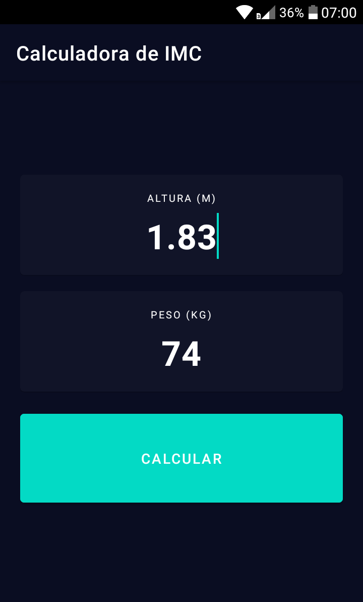
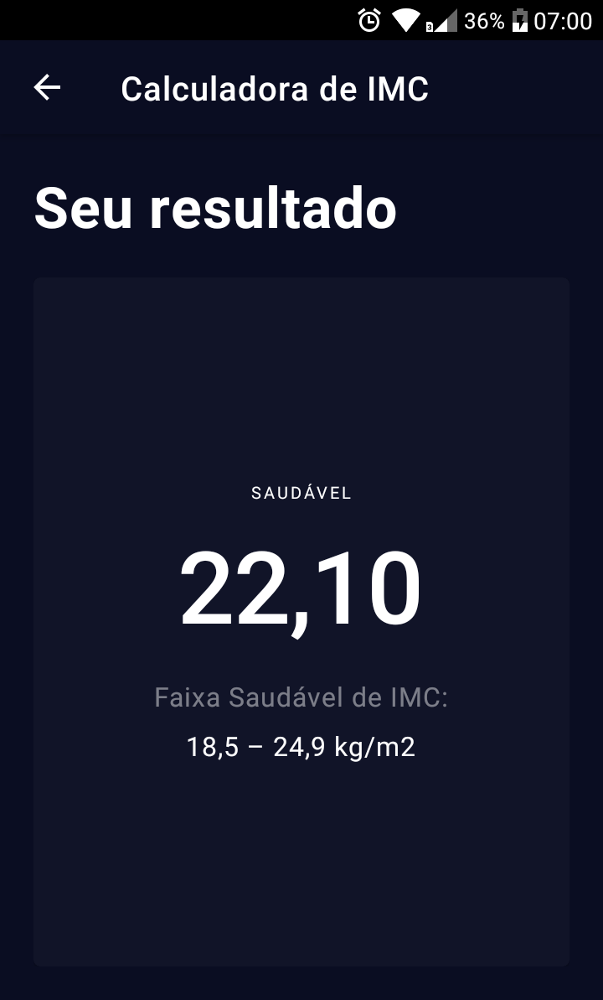

# Calculadora de IMC

Calculadora de notas do [bootcamp everis Kotlin Developer](https://digitalinnovation.one/bootcamps/everis-kotlin-developer) na [Digital Innovation One](https://digitalinnovation.one/)

Design inspirado na [Simple BMI Calculator](https://dribbble.com/shots/4585382-Simple-BMI-Calculator) criada por [Ruben Vaalt](https://dribbble.com/rvaalt)

 

